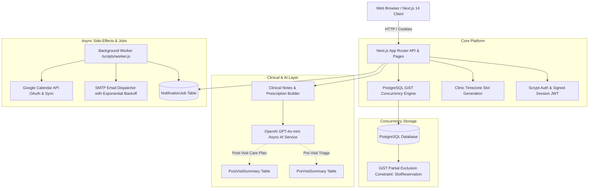

# CareFlow — Healthcare Appointment & Follow-up Manager

CareFlow is a full-stack, concurrency-safe healthcare scheduling, clinical consultation, and patient follow-up platform designed for clinics and hospital systems. It features database-level exclusion constraints to prevent double-booking, pre-visit AI clinical triage, post-visit patient summaries, a durable notification outbox, and real-time Google Calendar synchronization.

---

## Architecture Diagram



---

## Tech Stack

- **Framework**: Next.js 14 (App Router, Server Components & Route Handlers)
- **Language**: TypeScript (Strict Mode)
- **Database & ORM**: PostgreSQL with Prisma ORM and `btree_gist` extension
- **Styling**: Tailwind CSS
- **Authentication**: Scrypt password hashing (`crypto.scrypt`), signed HMAC-SHA256 session cookies (`careflow_session`)
- **AI Integration**: OpenAI API (`gpt-4o-mini`) with structured Zod schema validation
- **Calendar Integration**: Google Calendar API (OAuth 2.0 with AES-256-GCM encrypted tokens at rest)
- **Background Processing**: PostgreSQL Outbox Pattern with exponential backoff worker (`scripts/worker.js`)
- **Testing**: Node.js Test Runner (`node:test`) with TypeScript compiler

---

## User Roles & Capabilities

### 1. Patient Portal (`/patient`)
- **Doctor Search & Specialty Filtering**: Filter verified doctors by department (*Cardiology, Dermatology, General Medicine, etc.*) and text search.
- **Availability & Timezone Slots**: Real-time available slots computed in clinic timezone (`Asia/Kolkata`).
- **5-Minute Slot Hold**: Safely reserve a slot with concurrency protection while entering symptoms.
- **Appointment Management**: View countdowns, cancel, or atomically reschedule appointments.
- **Prescriptions & Active Reminders**: View prescribed medications, daily intake frequencies, instructions, and reminder times.
- **Patient-Friendly AI Care Plans**: View plain-English post-visit summaries, medication schedules, and follow-up guidance.
- **Google Calendar Sync**: Connect Google Calendar with one-click OAuth 2.0.

### 2. Doctor Portal (`/doctor`)
- **Clinical Schedule & Dashboard**: Filter daily visits by *Today*, *Upcoming*, and *All Consultations*.
- **Pre-Visit AI Clinical Triage**: Review patient symptoms with urgency badge (*High / Medium / Low*), chief complaint, 3 suggested clinical questions, and non-diagnostic disclaimer.
- **Consultation Workspace**: Record clinical findings, write prescriptions with medication dosage/frequency/reminders, and complete visits in a single atomic transaction.
- **Google Calendar Sync**: Synchronize consultation schedule with Google Calendar.

### 3. Administrator Console (`/admin`)
- **Doctor Management**: Onboard new doctors, toggle active status, and configure slot durations.
- **Schedule Configuration**: Edit weekly working hours intervals (weekdays 0–6) with interval overlap validation.
- **Doctor Leave & Conflict Resolution**: Schedule doctor leaves with automated transactional cancellation of overlapping appointments, slot reservation releases, patient notification dispatch, and calendar event deletion.

---

## Core Technical Concepts

### 1. Double-Booking Prevention
Double-booking is prevented at the database storage engine level using a **PostgreSQL GiST partial exclusion constraint** on the `SlotReservation` table:
```sql
ALTER TABLE "SlotReservation" 
ADD CONSTRAINT "SlotReservation_active_doctor_time_excl"
EXCLUDE USING gist (
  "doctorId" WITH =,
  tstzrange("startAt", "endAt", '[)') WITH &&
)
WHERE ("status" = 'ACTIVE');
```
Any colliding concurrent hold or booking request is aborted by PostgreSQL with code `23P01`, which CareFlow maps to `HTTP 409 Conflict`.

### 2. Slot Hold Mechanism
- Creating a hold places an `ACTIVE` reservation of kind `HOLD` with a 5-minute expiration timer (`expiresAt = now + 5 min`).
- If unconfirmed after 5 minutes, the hold is marked `EXPIRED` and its reservation is updated to `RELEASED`, immediately unlocking the slot for others.
- Confirming transitions the hold to `CONSUMED` and the reservation to kind `APPOINTMENT`.

### 3. Doctor Leave Conflict Handling
Scheduling doctor leave transactionally:
1. Creates the `DoctorLeave` record.
2. Identifies all overlapping confirmed appointments in `[startAt, endAt)`.
3. Marks affected appointments `CANCELLED` (`Doctor on leave: <reason>`).
4. Releases linked `SlotReservation` rows.
5. Enqueues durable patient outbox notifications (`DOCTOR_LEAVE`).
6. Enqueues deletion of linked Google Calendar events.
7. Excludes the leave date from future slot generation.

### 4. Asynchronous Clinical AI
- Pre-visit symptoms and post-visit clinical notes are processed using OpenAI structured JSON outputs with strict Zod validation.
- **AI failures never fail or roll back appointments or consultations.** Failures are recorded in `errorMetadata` and can be retried interactively by the doctor.

### 5. Durable Notification Outbox
- Business operations insert `NotificationJob` records with idempotency keys.
- The worker executes jobs with bounded exponential backoff (`1m, 5m, 15m, 1h, 4h`) up to 5 attempts. Email provider outages never block patient transactions.

### 6. Google Calendar Integration
- Secure OAuth 2.0 authorization code flow with signed HMAC-SHA256 CSRF state tokens.
- Google refresh tokens are encrypted at rest using **AES-256-GCM** before database storage.
- Asynchronously creates, updates (on reschedule), and deletes (on cancel) Google Calendar events.

---

## Project Directory Structure

```text
healthcare-appointment-manager/
├── app/                        # Next.js 14 App Router Pages & API Routes
│   ├── admin/                  # Admin portal (dashboard, onboarding, schedule/leave editor)
│   ├── api/                    # REST API routes (auth, doctors, appointments, calendar, jobs)
│   ├── doctor/                 # Doctor portal (schedule, consultation workspace)
│   ├── patient/                # Patient portal (dashboard, doctor search, booking, details)
│   ├── login/                  # Universal login with quick demo buttons
│   ├── register/               # Patient registration page
│   ├── layout.tsx              # Root HTML & session navigation layout
│   └── page.tsx                # SaaS landing page
├── components/                 # Reusable UI components (Navbar, StatusBadge)
├── docs/                       # Technical specifications & documentation
│   ├── API.md                  # Comprehensive API reference
│   ├── DATABASE.md             # Prisma schema & PostgreSQL GiST documentation
│   ├── ENGINEERING_SPEC.md     # Engineering requirements & design specs
│   ├── GOOGLE_CALENDAR.md      # Google Cloud & OAuth setup guide
│   ├── LLM.md                  # Clinical AI prompts & validation architecture
│   ├── SECURITY.md             # Security audit & threat model documentation
│   └── SYSTEM_DESIGN.md        # Technical concurrency & resilience design (<800 words)
├── lib/                        # Core backend services & utilities
│   ├── services/               # Business logic services
│   │   ├── ai.service.ts       # OpenAI structured pre/post-visit summaries
│   │   ├── appointment.service.ts # Booking, cancellation, atomic rescheduling
│   │   ├── auth.service.ts     # User registration & authentication
│   │   ├── availability.service.ts # Clinic timezone slot generation engine
│   │   ├── consultation.service.ts # Doctor notes & prescription manager
│   │   ├── doctor.service.ts   # Doctor profile, working hours & leave manager
│   │   ├── email.service.ts    # Notification templates & SMTP delivery
│   │   ├── google-calendar.service.ts # OAuth, token encryption & calendar sync
│   │   ├── notification.service.ts # Outbox job worker & reminder scanner
│   │   └── reservation.service.ts # Concurrency holds & GiST conflict handler
│   ├── auth.ts                 # Scrypt hashing & HMAC-SHA256 JWT tokens
│   ├── prisma.ts               # Prisma database client singleton
│   ├── types.ts                # TypeScript interfaces & Enum re-exports
│   └── validations.ts          # Zod validation schemas
├── prisma/                     # Database migrations and seed script
│   ├── migrations/             # SQL migrations (including GiST exclusion constraint)
│   ├── schema.prisma           # Complete database schema
│   └── seed.ts                 # Verified test seed data
├── scripts/                    # Helper & background runner scripts
│   ├── test.js                 # TypeScript test suite runner
│   └── worker.js               # Standalone outbox background worker
├── tests/                      # Automated test suite (49 tests across 10 suites)
│   ├── ai.test.ts
│   ├── auth.test.ts
│   ├── availability.test.ts
│   ├── booking.test.ts
│   ├── calendar.test.ts
│   ├── concurrency.test.ts
│   ├── consultation.test.ts
│   ├── lifecycle.test.ts
│   ├── notifications.test.ts
│   └── ownership.test.ts
├── .env.example                # Documented environment variable template
├── package.json                # Project dependencies and scripts
└── tsconfig.json               # TypeScript configuration
```

---

## Local Setup & Development

### 1. Prerequisites
- **Node.js**: v18.17.0+ or v20+
- **PostgreSQL**: v14+ (with `btree_gist` extension available)

### 2. Installation
```bash
git clone <repository-url>
cd healthcare-appointment-manager
npm install
```

### 3. Environment Configuration
Copy `.env.example` to `.env` and fill in your values:
```bash
cp .env.example .env
```

### 4. Database Setup & Migrations
```bash
# Run database migrations (creates tables and GiST exclusion constraint)
npx prisma migrate dev

# Seed database with demo accounts, doctors, and working hours
npm run db:seed
```

### 5. Start Application
```bash
# Start Next.js development server
npm run dev

# (Optional) Start standalone outbox background worker in a separate terminal
npm run worker
```
Access the application at `http://localhost:3000`.

---

## Running Tests & Quality Verification

```bash
# Run the complete automated test suite (49 tests across 10 suites)
npm test

# Run TypeScript typecheck
npm run typecheck

# Run ESLint
npm run lint

# Build production bundle
npm run build
```

---

## Demo Accounts

All demo accounts share the password: `CareFlowDev123!`

| Role | Email | Name / Specialisation |
| :--- | :--- | :--- |
| **Admin** | `admin@careflow.test` | Clinic Operations Admin |
| **Doctor** | `dr.mehta@careflow.test` | Dr. Rajesh Mehta (Cardiology) |
| **Doctor** | `dr.sharma@careflow.test` | Dr. Priya Sharma (Dermatology) |
| **Patient** | `patient.one@careflow.test` | Aarav Patel |
| **Patient** | `patient.two@careflow.test` | Diya Rao |

*(The `/login` page includes convenient one-click demo login buttons for evaluation).*

---

## External Integrations Setup

1. **Google Calendar Setup**: See detailed guide in [`docs/GOOGLE_CALENDAR.md`](file:///c:/Users/aksha/healthcare-appointment-manager/docs/GOOGLE_CALENDAR.md). In local development without Google credentials, mock mode is activated automatically.
2. **Clinical AI Setup**: See detailed guide in [`docs/LLM.md`](file:///c:/Users/aksha/healthcare-appointment-manager/docs/LLM.md). Configure `OPENAI_API_KEY` in `.env`.
3. **Email Notification Setup**: Configure `EMAIL_SMTP_URL` (e.g. Mailtrap or SendGrid) in `.env`. Leaving it blank outputs rendered email templates to the console.

---

## Known Limitations

- **SMS Reminders**: CareFlow currently sends outbox reminders via email. SMS delivery can be added by implementing an SMS adapter in `lib/services/notification.service.ts`.
- **Multi-Clinic Tenancy**: Currently configured for a single primary clinic timezone (`Asia/Kolkata`). Multi-timezone clinics require storing timezone per doctor profile.
