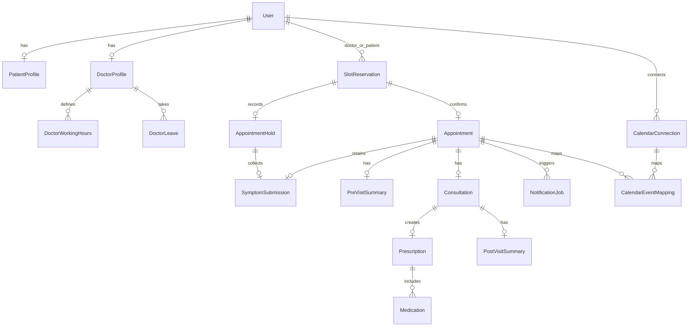

# CareFlow database architecture

This document describes the PostgreSQL/Prisma foundation in `prisma/schema.prisma`. The authoritative product behavior remains [ENGINEERING_SPEC.md](ENGINEERING_SPEC.md).

## Entities and relationships



- `User` stores credentials as `passwordHash`, never a plaintext password, and carries the Patient, Doctor, or Admin role.
- `PatientProfile` and `DoctorProfile` are protected one-to-one extensions of `User`. A doctor profile holds specialisation, active state, and slot duration.
- `DoctorWorkingHours` supports multiple local-time intervals for a doctor/day. `DoctorLeave` stores timestamp ranges and has a doctor/date index for availability and leave-conflict work.
- `Appointment`, `AppointmentHold`, and `SlotReservation` are deliberately separate. The first two retain workflow-specific data; `SlotReservation` is the canonical occupancy record used to make booking safe across both types.
- Symptoms can be retained with a hold during booking and linked to the confirmed appointment. Pre-visit and post-visit AI records preserve their outputs, status, and error data.
- `Consultation`, `Prescription`, and `Medication` support clinical notes, follow-up information, and medication-frequency reminders.
- `NotificationJob` is the durable outbox/job record, with recipient, optional appointment/prescription relation, attempts, retry time, last error, and a globally unique idempotency key.
- `CalendarConnection` stores encrypted-refresh-token storage metadata; `CalendarEventMapping` holds per-appointment, per-connected-account Google event synchronization state.

## Important indexes and constraints

- Unique email, one-to-one profile foreign keys, and one-to-one appointment/hold reservation links protect identity and workflow cardinality.
- Doctor/date indexes exist on appointments, holds, leaves, and canonical reservations. Patient/date indexes support patient appointment history. Job status/next-attempt and calendar sync-status indexes support worker polling.
- Checks require positive slot duration, weekdays from 0–6, ordered working-hour text intervals, and `startAt < endAt` for leave, hold, appointment, and reservation ranges.
- Cascade deletes are used only for dependent profile/configuration, generated summaries, prescriptions/medications, mappings, and outbox data. Core patient, doctor, appointment, hold, reservation, and consultation references use `RESTRICT` to avoid losing clinical/booking history accidentally.
- Application validation must enforce the specification's exactly-three pre-visit questions, legal state transitions, role ownership, and that the workflow-specific hold/appointment fields match their canonical reservation. Prisma itself cannot express those rules.

## Reservation and exclusion-constraint architecture

An `AppointmentHold` alone cannot protect a slot from an `Appointment`, because PostgreSQL constraints on separate tables cannot compare rows across those tables. CareFlow therefore creates one `SlotReservation` for every held or confirmed time slot.

The initial migration enables PostgreSQL's `btree_gist` extension and adds this partial exclusion constraint:

```sql
EXCLUDE USING gist (
  "doctorId" WITH =,
  tstzrange("startAt", "endAt", '[)') WITH &&
)
WHERE ("status" = 'ACTIVE'::"ReservationStatus")
```

`SlotReservation` is the database-level source of truth for active occupancy. A hold creates an `ACTIVE` reservation of kind `HOLD`; confirmation reuses it as kind `APPOINTMENT`; expiry, cancellation, or completion releases it. Only active rows participate in the exclusion constraint.

The `[)` bound is half-open: `[10:00, 10:30)` and `[10:30, 11:00)` do not overlap and are accepted; `[10:00, 10:30)` and `[10:15, 10:45)` overlap and PostgreSQL rejects the second insert/update for the same doctor.

## Simultaneous booking behavior

The booking service must create or confirm the reservation, hold/appointment, symptom association, and outbox records in one PostgreSQL transaction. Two users may both read an available slot, but only one transaction can insert or activate the conflicting `SlotReservation`. The other receives the PostgreSQL exclusion-constraint error, the transaction rolls back, and the API returns `409 Conflict` with refreshed availability.

## Database-level versus application-level guarantees

| Database-level | Application-level |
| --- | --- |
| Foreign keys, one-to-one/unique keys, check constraints, indexes, and the active-reservation exclusion constraint. | Role/ownership authorization, appointment and hold transitions, expiry processing, copying/validating canonical reservation values, symptom workflow, exactly three suggested questions, and scheduling/retrying integration jobs. |
| PostgreSQL rejects overlapping active ranges for one doctor, including hold-versus-appointment conflicts. | Booking code performs the required transaction and maps the exclusion conflict to a user-safe response. |
| A calendar, email, or LLM job can be recorded durably without changing confirmed appointment state. | Workers process/retry jobs; failures never roll back committed appointments. |

## Development seed data

`prisma/seed.js` creates one admin, three active doctors (Cardiology, Dermatology, and General Medicine), Monday–Friday working hours, and two patients. All accounts use the development-only password `CareFlowDev123!`; these values must never be deployed to production.
